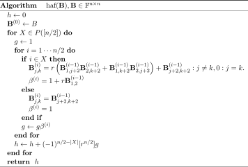

.. role:: raw-latex(raw)
   :format: latex

.. role:: html(raw)
   :format: html

.. _algorithms:

The algorithms
==============

.. sectionauthor:: Nicolás Quesada <nicolas@xanadu.ai>

The exact calculation of the number of perfect matchings  (and the hafnian) for general graphs (symmetric matrices) has been investigated by several authors in recent years. An algorithm running in :math:`O(n^2 2^n)`  time was given by Björklund and Husfeldt :cite:`bjorklund2008exact` in 2008. In the same paper an algorithm running in :math:`O(1.733^n)` time was presented using fast matrix multiplication. In the same year Kan :cite:`kan2008moments` presented an algorithm running in time :math:`O(n 2^n)` by representing the hafnian as a moment of the multinormal distribution. Koivisto :cite:`koivisto2009partitioning` gave an :math:`O^*(\phi^n)` time and space algorithm, where :math:`\phi = (1+\sqrt{5})/2 \approx 1.618` is the Golden ratio. Nederlof :cite:`nederlof2009fast` provided a polynomial space algorithm running in :math:`O(1.942^n)` time.

Finally, Björklund :cite:`bjorklund2012counting` :cite:`bjorklund2018faster` and later Cygan and Pilipczuk :cite:`cygan2015faster` provided :math:`O(\text{poly}(n) 2^{n/2})` time and polynomial space algorithms for the calculation of the general ring hafnian. These algorithms are believed to be close to optimal unless there are surprisingly efficient algorithms for the Permanent. This is because these two algorithms can also be used to count (up to polynomial corrections) the number of perfect matchings for bipartite graphs with the same exponential growth as Ryser's algorithm for the permanent :cite:`ryser1963combinatorial`. Equivalently, if one could construct an algorithm that calculates hafnians in time :math:`O(\alpha^{n/2})` with :math:`\alpha<2` one could calculate permanents *faster* than Ryser's algorithm (which is the fastest known algorithm to calculate the permanent :cite:`rempala2007symmetric`). This is because of the identity

.. math::
	\text{haf} \left( \left[
	\begin{array}{cc}
	0 & \bm{W} \\
	\bm{W}^T & 0 \\
	\end{array}
	\right]\right) = \text{per}(\bm{W}),

which states that a bipartite graph with two parts having :math:`n/2` elements can always be thought as a simple graph with :math:`n` vertices.
It should be noted that improving over Ryser's algorithm is a well-known open problem: e.g. Knuth :cite:`TAOCP` asks for an arithmetic circuit for the permanent with less than :math:`2^n` operations. Also note that since the exact calculation of the permanent of :math:`(0,1)` matrices is in the \#P complete class :cite:`valiant1979complexity` the above identity shows that deciding if the hafnian of a complex matrix is larger than a given value is also in the \#P complete class.

.. tip::

   Permanents can be calculated directly using Ryser's algorithm via :func:`thewalrus.perm`.

Finally, note that the approximate methods developed for counting perfect matchings are aimed at (weighted-)graphs with real or positive entries  :cite:`2016arXiv160107518B,10.1007/3-540-36494-3_38`. Of particular note is the approximate algorithm introduced by Barvinok for matrices with non-negative entries :cite:`barvinok1999polynomial` further analyzed in Ref. :cite:`rudelson2016hafnians`.

In what follows we provide a pseudo-code or equations that give a basic intuition for the algorithms implemented in this library. The reader is referred to the original literature for proof of correctness and complexity.

Reference algorithm
-------------------

We provide a reference implementation of the hafnian and loop hafnian that iterates over the sets :math:`\text{PMP}(n)` and :math:`\text{SPM}(n)`. These implementations are extremely slow for even moderate sized matrices and are only provided for educational purposes.

.. tip::

   *Implemented as* :func:`thewalrus.reference.hafnian`. The optional argument ``loops=True`` can be used to calculate loop hafnians.

Recursive algorithm
-------------------
In 2012 Björklund :cite:`bjorklund2012counting` introduced the following algorithm to calculate the hafnian of a matrix of size :math:`n` (even) in any field :math:`\mathbb{F}` in time :math:`O(n^4 \log(n) 2^{n/2})`

In the pseudocode above the following notation is used:

* :math:`[n]=\{0,1,2,\ldots,n-1\}` is the set of the first :math:`n` integers,

* :math:`|X|` is used to denote the number of elements in the set :math:`X`, and

* :math:`P(X)` is used to denote the power set, which is the set of all the subsets of the set :math:`X`. Note that if :math:`X` has :math:`|X|` elements, then its power set has :math:`2^{|X|}` elements.

Note that the subindices and superindices in the matrices :math:`\bm{B}` are not used for components of the matrices but rather to denote stages in the computation.
Furthermore, these matrices contain polynomials in the symbolic variable :math:`r` and that the final answer is obtained by adding the coefficients of :math:`r^{n/2}` in the polynomial :math:`g` at each step. In the implementation provided in this library the algorithm sketched above in pseudocode is turned into a recursion relation, hence the name we give it here.

Unfortunately, there is no known generalization of this algorithm to loop hafnians.

.. tip::

   *Implemented as* :func:`thewalrus.hafnian`. This is the default algorithm for calculating hafnians.

Eigenvalue-trace algorithm
--------------------------
Based on the work of Cygan and Pilipczuk :cite:`cygan2015faster`, Björklund *et al* :cite:`bjorklund2018faster` introduced another algorithm to calculate the hafnian of a real or complex matrix of size :math:`n` in 2018. This algorithm which runs in time :math:`O(n^3 2^{n/2})` and can be more succinctly expressed as an equation

.. math::
	\text{haf}(\bm{A}) = \sum_{S \in P([n/2])} (-1)^{ |S|} f\left((\bm{A} \bm{X})_{S}\right),

where the matrix :math:`\bm{X}` is defined as

.. math::
	\bm{X}= \bm{X}^T=\bm{X}^{-1}= \begin{bmatrix}
		\bm{0} & \mathbb{I} \\
		\mathbb{I} & \bm{0}
	\end{bmatrix},

:math:`\mathbb{I}` is the identity matrix and the function :math:`f(\bm{C})` takes a matrix  :math:`\bm{C}` and returns the coefficient of :math:`\eta^{n/2}` in the following polynomial:

.. math::
	p_{n/2}(\eta \bm{C}) = \sum_{j=1}^{n/2} \frac{1}{j!}\left(\sum_{k=1}^{n/2} \frac{\text{tr}(\bm{C}^k)}{2k}\eta^k \right)^j.

This coefficient can be found by taking derivatives :cite:`quesada2018gaussian`

.. math::
	f(\bm{C}) = \frac{1}{(n/2)!}  \left. \frac{d^{n/2}}{d\eta^{n/2}} p_{n/2}(\eta \bm{C}) \right|_{\eta=0} = \frac{1}{(n/2)!}  \left. \frac{d^{n/2}}{d\eta^{n/2}} \frac{1}{\sqrt{\det(\mathbb{I} - \eta \bm{C})}} \right|_{\eta=0}.

The function :math:`p_{n/2}(\eta\bm{C})` requires only the traces of the matrix powers of the matrices :math:`\bm{C}^k`, hence the name of this algorithm.

Note that these traces can be written in terms of the sums of powers of the eigenvalues of the matrix :math:`\bm{C}`.

This formula generalizes to the loop hafnian as follows

.. math::
	\text{lhaf}(\bm{A}) = \sum_{S \in P([n/2])} (-1)^{ |S|} f\left((\bm{A} \bm{X})_{S}\right),

where now the function :math:`f(\bm{C})` takes a matrix  :math:`\bm{C}` and returns the coefficient of :math:`\eta^{n/2}` in the following polynomial:

.. math::
	q(\eta,  \bm{C}, \bm{v} ) = \sum_{j=1}^{n/2} \frac{1}{j!} \left(\sum_{k=1}^{n/2}  \left( \frac{\text{Tr}(\bm{C}^k) }{(2k)} +\frac{\bm{v} (\bm{X} \bm{B})^{k-1} \bm{v}^T}{2} \right) \eta^k \right)^j.

where :math:`\bm{v} = \text{diag}(\bm{C})` and we used the reduction operation (cf. :ref:`notation <notation>`) in terms of the set :math:`S`.

.. tip::

   *Implemented as* :func:`thewalrus.hafnian` with the argument ``recursive=False``.
   The loop hafnian calculation can be done by setting the option ``loops=True``.

Repeated-moment algorithm
-------------------------
By mapping the calculation of moments of the multinormal distribution to the calculation of the hafnian, Kan :cite:`kan2008moments` derived the following equation for the loop hafnian

.. math::
	\text{lhaf}\left( \text{vid}(\bm{B}_\bm{m},\bm{u}_\bm{m}) \right) &= \sum_{\nu_0=0}^{m_0} \ldots \sum_{\nu_{n-1}}^{m_{n-1}} \sum_{r=0}^{[m/2]} (-1)^{\sum_{i=0}^{n-1} \nu_i} {m_0 \choose \nu_0} \ldots {m_{n-1} \choose \nu_{n-1}} \frac{\left( \frac{\bm{h}^T \bm{B} \ \bm{h}}{2} \right)^r \left(\bm{h}^T \bm{u} \right)^{m-2r}}{r! (m-2r)!}, \\
	\bm{h} &= \left(\tfrac{m_{0}}{2}-\nu_0,\ldots,\tfrac{m_{n-1}}{2}-\nu_{n-1} \right),\\
	m&=m_0+\ldots+m_{n-1},

where we used the reduction and vector in diagonal (:math:`\text{vid}`) operations introduced in the  :ref:`notation <notation>` section.

Note that if we pick :math:`m_i=1 \ \forall i` and :math:`\bm{v} = \text{diag}(\bm{A})` we recover the loop hafnian of :math:`\bm{A}`. In this case, the calculation of the loop hafnian requires :math:`O(n 2^n)` operations, which is quadratically worse than Björklund's algorithms. This formula is however useful when calculating hafnians and loop hafnians of matrices with repeated rows and columns for which column and row :math:`i` are repeated :math:`m_i` times; taking only :math:`O(n A G^n)` operations to calculate the loop hafnian, where

.. math::
	A &= \frac{1}{n} \sum_{i=0}^{n-1} (m_i+1), \\
 	G &= \left( \prod_{i=0}^{n-1}(m_i+1) \right)^{1/n}.

Compare this with Björklund's algorithm, which requires :math:`O\left((A n)^3 \left(\sqrt{2}^{A}\right)^n\right)` operations.

.. tip::

   *Implemented as* :func:`thewalrus.hafnian_repeated`. The vector :math:`\bm{m}` is passed in the variable ``rpt``. The loop hafnian calculation can be done by passing the variable ``mu`` with the values of the vector :math:`\bm{u}` and the option ``loops=True``.

Batched algorithm
-----------------
Using the multidimensional Hermite polynomials, and their connection to the matrix elements of Gaussian states and hafnians discussed in the next section, one can calculate the hafnians of all reductions of a matrix :math:`\bm{B} \in \mathbb{C}^{n \times n}` up to a given cutoff. The reduction of matrix :math:`\bm{B}` is precisely the matrix :math:`\bm{B}_{\bm{m}}` obtained by repeating (or removing) the :math:`i^{\text{th}}` row and column :math:`m_i` times. Thus given a cutoff :math:`m_{\max}`, one can use the batched algorithm to calculate

.. math::
	\text{haf}\left( \bm{B}_\bm{m} \right)

for all :math:`0\leq m_i < m_{\max}`, thus this function returns a tensor with :math:`(m_{\max})^n` components.

One can also use this function to calculate the same loop hafnians that Kan's algorithm returns

.. math::
	\text{lhaf}\left( \text{vid}(\bm{B}_\bm{m},\bm{u}_\bm{m}) \right)

if provided also with a vector :math:`\bm{u}`. Note that this parameter is optional.

Internally, these hafnians are calculated by using the recursion relation of the multidimensional Hermite polynomials discussed in the next section.

.. tip::

   *Implemented as* :func:`thewalrus.hafnian_batched`. The loop hafnian calculation can be done by passing the variable ``mu`` with the values of the vector :math:`\bm{u}`.

Approximate algorithm
---------------------
In 1999 Barvinok :cite:`barvinok1999polynomial` provided a surprisingly simple algorithm to approximate the hafnian of a symmetric matrix with non-negative entries. Let the matrix have entries :math:`A_{i,j}` and define the antisymmetric stochastic matrix with entries that distribute according to :math:`W_{i,j} = -W_{i,j}   \sim \mathcal{N}(0,A_{i,j})`, where :math:`\mathcal{N}(\mu,\sigma^2)` is the normal distribution with mean :math:`\mu` and variance :math:`\sigma^2`. The following now holds:

.. math::
	\text{haf}(\bm{A}) = \mathbb{E} \left( \text{det}(\bm{W}) \right)

where :math:`\mathbb{E}` denotes the usual statistical expectation value, and :math:`\text{det}` is the determinant. This formula has not been generalized to loop hafnians.

.. tip::

   *Implemented as* :func:`thewalrus.hafnian` with ``approx=True``. Note that one needs to pass the number of samples used to estimate the expectation value in the formula above; this is specified with the argument ``num_samples``.

Low-rank algorithm
------------------
If a symmetric matrix :math:`\bm{A} \in \mathbb{C}^{n \times n}` is of low rank it can be written as :math:`\bm{A} = \bm{G} \bm{G}^T` where :math:`\bm{G} \in \mathbb{C}^{n \times r}` is a rectangular matrix and :math:`r \leq n` is the rank of :math:`\bm{A}`. One can then calculate the hafnian of the matrix :math:`\bm{A}` in time and space complexity :math:`{n+r-1 \choose r-1}` by generalizing the result derived Barvinok :cite:`barvinok1996two` for permanents to hafnians as derived in Appendix C of Björklund *et al* :cite:`bjorklund2018faster`. The algorithm works by defining the following multivariate polynomial

.. math::
	q(x_0,\ldots,x_{r-1}) = \prod_{i=0}^{n-1} \sum_{j=0}^{r-1} G_{i,j} x_j.

Consider now the :math:`r`-partitions of the integer :math:`n`, there are :math:`{n+r-1 \choose r-1}` of such partitions. Let :math:`e=(e_0,\ldots,e_{r-1})` be an even :math:`r`-partition (i.e. an :math:`r`-partition where each element is even), call :math:`\mathcal{E}_{n,r}` the set of all even :math:`r`-partitions, and define :math:`\lambda_e` to be the coefficient of :math:`x_0^{e_0}\ldots x_{r-1}^{e_{r-1}}` in the polynomial :math:`q(x_0,\ldots,x_{r-1})`. Then one can write the hafnian of :math:`\bm{A} = \bm{G} \bm{G}^T` as

.. math::
	\text{haf}(\bm{A}) = \sum_{e \in \mathcal{E}_{n,r}} \lambda_e  \prod_{i=0}^{r-1} (e_i - 1)!! .

.. tip::

   *Implemented as* :func:`thewalrus.low_rank_hafnian`. This function takes as argument the matrix :math:`\bm{G} \in \mathbb{C}^{n \times r}` and returns the value of the hafnian of the matrix :math:`\bm{A} = \bm{G} \bm{G}^T`