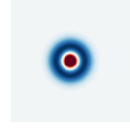
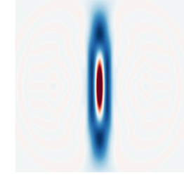
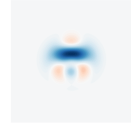
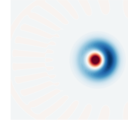
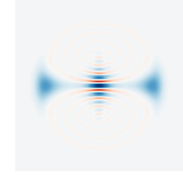
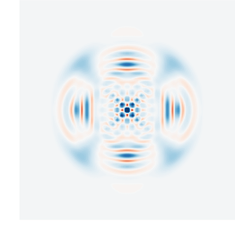

.. _gallery:

Non-Gaussian states gallery
##########################

Here you can find a curated list of Gaussian circuits and photon-number-resolved measurements to prepare non-Gaussian states of interest in quantum optics, information, metrology and computing.

The original idea of using general Gaussian states and photon-number-resolved measurements to generate complex non-Gaussian states was originally introduced by K.K. Sabapathy, H. Qi, J. Izaac, and C. Weedbrook in [
Phys. Rev. A 100, 012326, (2019)](https://journals.aps.org/pra/abstract/10.1103/PhysRevA.100.012326) and it was further elaborated by D. Su, C.R. Myers, K.K. Sabapathy in (arXiv:1902.02323)[https://arxiv.org/abs/1902.02323].

If you develop a new circuit and measurement scheme to prepare a non-Gaussian state, add it to the gallery!

.. Copy the template below in order to create a link to your notebook, and a thumbnail.

.. _Fock: fock.html

.. _Kitten: kitten.html

.. _Cubic: cubic.html

.. _Added: photon_added.html

.. _Cat: cat.html

.. _FourCat: fourcat.html

.. rst-class:: gallery-table

+-------------------------------+-------------------------------+------------------------------+
| |fock|                        | |kitten|                      | |cubic|                      |
|                               |                               |                              |
| Fock states                   | Kitten states                 | Cubic phase states           |
+-------------------------------+-------------------------------+------------------------------+
| |photon_added|                | |cat|                         | |four_cat|                   |
|                               |                               |                              |
| Photon added states           | Cat states                    | Four-headed cat states       |
+-------------------------------+-------------------------------+------------------------------+
