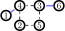
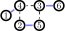

.. role:: raw-latex(raw)
   :format: latex

.. role:: html(raw)
   :format: html

.. _hafnian:

The hafnian
===========
.. sectionauthor:: Nicolás Quesada <nicolas@xanadu.ai>

The hafnian
***********

The hafnian of an :math:`n \times n`, symmetric matrix :math:`\bm{A} =\bm{A}^T` is defined as :cite:`barvinok2016combinatorics` 

.. math::
   \label{eq:hafA}
   \haf(\bm{A}) = \sum_{M \in \text{PMP}(n)} \prod_{\scriptscriptstyle (i, j) \in M} A_{i, j},

where :math:`\text{PMP}(n)` stands for the set of perfect matching permutations of :math:`n` (even) objects, i.e., permutations :math:`\sigma:[n]\rightarrow [n]` such that :math:`\forall i:\sigma(2i-1)<\sigma(2i)` and :math:`\forall i:\sigma(2i-1)<\sigma(2i+1)`.

It was so named by Eduardo R. Caianiello :cite:`caianiello1953quantum` "to mark the fruitful period of stay in Copenhagen (*Hafnia* in Latin)." :cite:`termini2006imagination`

The set PMP(:math:`n`) used to define the hafnian contains

.. math::
   \label{eq:haf1}
   |\text{PMP}(n)|=(n-1)!! = 1 \times 3 \times 5 \times \ldots \times (n -1),

elements and thus as defined it takes :math:`(n-1)!!` additions of products of :math:`n/2` numbers to calculate the hafnian of an :math:`n \times n` matrix.
Note that the diagonal elements of the matrix :math:`\bm{A}` do not appear in the calculation of the hafnian and are (conventionally) taken to be zero.

For :math:`n=4` the set of perfect matchings is

.. math::
   \label{eq:PMP4}
   \text{PMP}(4) = \big\{ (0,1)(2,3),\ (0,2)(1,3),\ (0,3),(1,2) \big\},

and the hafnian of a :math:`4 \times 4` matrix :math:`\bm{B}` is

.. math::
   \label{eq:hafB}
   \haf(\bm{B}) = B_{0,1} B_{2,3}+B_{0,2}B_{1,3}+B_{0,3} B_{1,2}.

The hafnian of an odd sized matrix is defined to be zero; if :math:`\bm{A}=\bm{A}^T` is :math:`M` dimensional and :math:`M` is odd then :math:`\haf(\bm{A}) = 0`. Note that, for convenience, we define the hafnian of an empty matrix, i.e., a matrix of dimension zero by zero, to be 1.

The hafnian is a homogeneous function of degree :math:`n/2` in the matrix entries of an :math:`n \times n` matrix :math:`\bm{A}`. This implies that

.. math::
   \haf(\mu \bm{A}) = \mu ^{n/2} \haf(\bm{A}),

where :math:`\mu` is a scalar. More generally, if :math:`\bm{W} = \text{diag}(w_0,\ldots,w_{n-1})`, then it holds that (see proposition 4.2.3 of :cite:`barvinok2016combinatorics`)

.. math::
   \haf( \bm{W} \bm{A} \bm{W} ) = \left(\prod_{i=0}^{n-1} w_i\right) \haf(\bm{A}).

The definition used to introduce the hafnian is rather algebraic and brings little intuition.
To gain more insight in the next section we introduce some graph theory language and use it to present a more intuitive vision of what the hafnian "counts".

Basics of graphs
****************

A graph is an ordered pair :math:`G=(V,E)` where :math:`V` is the set of vertices, and :math:`E` is the set of edges linking the vertices of the graph, i.e., if :math:`e \in  E` then :math:`e=(i,j)` where :math:`i,j \in  V`.
In this section we consider graphs without loops (we relax this in the next section), thus we do not allow for edges :math:`e = (i,i)` connecting a given vertex to itself. 
A 6 vertex graph is shown here

the vertices are labelled :math:`V = \{1,2,3,4,5,6 \}` and the edges are :math:`E=\{(1,4),(2,4),(2,5),(3,4),(3,5),(3,6),(5,5) \}`.

A matching :math:`M` is a subset of the edges in which no two edges share a vertex. An example of matching is :math:`M=(1,4)(3,6)` represented by the blue lines in the following figure

In the figure above we know we have a matching because none of the highlighted edges shares a vertex.

A perfect matching is a matching which matches all the vertices of the graph, such as for example :math:`M=(1,4)(2,5)(3,6)`, which is represented again by the blue lines in the following figure

The blue lines represent a *perfect* matching because, they are a matching, i.e., the edges do no overlap on any vertex *and* all the vertices are covered by one and only edge.

A complete graph is a graph where every vertex is connected to every other vertex.
For loopless graphs having :math:`n` vertices, the number of perfect matchings is precisely :cite:`barvinok2016combinatorics`

.. math::
   |\text{PMP}(n)|=(n-1)!! = 1 \times 3 \times  \ldots \times (n-1).

where we use :math:`\text{PMP}(n)` to indicate the set of perfect matchings of introduced in the previous section, and the notation :math:`|V|` to indicate the number of elements in the set :math:`V`. Note that this number is nonzero only for even :math:`n`, since for odd :math:`n` there will always be one unmatched vertex.

In the following figure we illustrate the 3 perfect matchings of a complete graph with 4 vertices

Perfect matchings and hafnians
*******************************

An important question concerning a given graph :math:`G=(V,E)` is the number of perfect matchings it has. One possible way to answer this question is to iterate over the perfect matchings of a complete graph and at each step check if the given perfect matching of the complete graph is also a perfect matching of the given graph. A simple way to automatize this process is by constructing the adjacency matrix of the graph. The adjacency matrix :math:`\bm{A}` of a graph :math:`G=(V,E)` is a 0-1 matrix that has :math:`\bm{A}_{i,j} = \bm{A}_{j,i}=1` if, and only if, :math:`(i,j) \in E` and 0 otherwise. For the example graph in the previous section, the adjacency matrix is

.. math::
   \bm{A}' = \begin{bmatrix}
      0 & 0 & 0 & 1 & 0 & 0 \\
      0 & 0 & 0 & 1 & 1 & 0 \\
      0 & 0 & 0 & 1 & 1 & 1 \\
      1 & 1 & 1 & 0 & 0 & 0 \\
      0 & 1 & 1 & 0 & 0 & 0 \\
      0 & 0 & 1 & 0 & 0 & 0
   \end{bmatrix}.

The number of perfect matchings of a (loopless) graph is simply given by the hafnian of its adjacency matrix

.. math::
   \text{haf}(\bm{A}) =  \sum_{M \in
     \text{PMP}(n)} \prod_{\scriptscriptstyle (i,j) \in  M} {A}_{i,j}.

For the graph in the previous section we can easily confirm that the perfect matching we found is the only perfect matching since

.. math::
   \text{haf}(\bm{A}')  = 1.

The definition of the hafnian immediately generalizes to weighted graphs, where we assign a real or complex number to the entries of the symmetric matrix :math:`\bm{A}`.

Special values of the hafnian
*****************************

Here we list some special values of the hafnian for certain special matrices.

* If the matrix :math:`\bm{A}` has the following block form

.. math::
   \bm{A}_{\text{block}} = \left[\begin{array}{c|c}
      0 & \bm{C} \\
      \hline
      \bm{C}^T & 0 \\
      \end{array}\right],

then it holds that :math:`\text{haf}\left(  \bm{A}_{\text{block}}  \right) = \text{per}(\bm{C})` where :math:`\text{per}` is the permanent matrix function defined as :cite:`barvinok2016combinatorics`

.. math::
   \text{per}(\bm{C})=\sum_{\sigma\in S_n}\prod_{i=1}^n C_{i,\sigma(i)}.

The sum here extends over all elements :math:`\sigma` of the symmetric group :math:`S_n`.

* If :math:`\bm{A}_{\text{rank-one}} = \bm{e} \bm{e}^T` is a rank one matrix of size :math:`n` then

.. math::
   \text{haf}\left( \bm{A}_{\text{rank-one}} \right) = (n-1)!! \prod_{i=1}^{n-1} e_i.

In particular, the hafnian of the all ones matrix is precisely :math:`(n-1)!!`.

* If :math:`\bm{A}_{\text{direct sum}} = \bm{A}_1 \oplus \bm{A}_2` is a block diagonal matrix then

.. math::
   \text{haf}\left(\bm{A}_{\text{direct sum}}\right) = \text{haf}\left( \bm{A}_1 \oplus \bm{A}_2 \right) = \text{haf}\left( \bm{A}_1 \right) \text{haf}\left( \bm{A}_2 \right).

This identity simply expresses the fact that the number of perfect matchings of a graph that is made of two disjoint subgraphs is simply the product of the number of perfect matchings of the two disjoint subgraphs.
