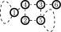
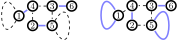
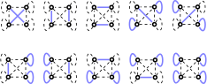

.. role:: raw-latex(raw)
   :format: latex

.. role:: html(raw)
   :format: html

.. _loophafnian:

The loop hafnian
=================
.. sectionauthor:: Nicolás Quesada <nicolas@xanadu.ai>

Graphs with loops
*****************

In the previous section we introduced the hafnian as a way of counting the number of perfect matchings of a *loopless* graph. The loop hafnian does the same for graphs with loops. Before defining the loop hafnian let us introduce graphs with loops. A graph will still be an ordered pair :math:`(V,E)` of vertices and edges but now we will allow edges of the form :math:`(i,i)` where :math:`i \in V`. We can now define adjacency matrices in the same way as we did before i.e. if :math:`(i,j) \in E` then :math:`M_{i,j}=1` and otherwise :math:`M_{i,j}=0`.

Consider the following graph

for which we have :math:`V = \{1,2,3,4,5,6 \}`, the edges are :math:`E=\{(1,1),(1,4),(2,4),(2,5),(3,4),(3,5),(3,6),(5,5) \}` and the adjacency matrix is

.. math::
	\bm{A}'' = \begin{bmatrix}
	1 & 0 & 0 & 1 & 0 & 0 \\
	0 & 0 & 0 & 1 & 1 & 0 \\
	0 & 0 & 0 & 1 & 1 & 1 \\
	1 & 1 & 1 & 0 & 0 & 0 \\
	0 & 1 & 1 & 0 & 1 & 0 \\
	0 & 0 & 1 & 0 & 0 & 0
	\end{bmatrix}.

Note that there are now nonzero elements in the diagonal indicating that vertices 1 and 5 have loops.

Once we allow for loops we have more options for making perfect matchings. For example for the graph shown above there are now 2 perfect matchings, illustrated in blue in the following figure

As was done before for the hafnian we introduce the set of single pair matchings :math:`\text{SPM}(n)` as the set of perfect matchings of a graph of size :math:`n`with loops :cite:`bjorklund2018faster`. For :math:`n=4` we have

.. math::

  \text{SPM}(4) = \big\{ (0,1)(2,3),\ (0,2)(1,3),\ (0,3),(1,2),\ (0,0)(1,1)(2,3), \ (0,1)(2,2)(3,3),\\
  (0,0)(2,2)(1,3),\ (0,2)(1,1)(3,3),\ (0,0)(3,3)(1,2),\ (0,3)(1,1)(2,2),\ (0,0)(1,1)(2,2)(3,3)\big\}.

For a graph with 4 vertices they are

Note that there is a one to one correspondence (a bijection) between the elements in :math:`\text{SPM}(n)` and the number of matchings of a graph with :math:`n` vertices :math:`H(n)`. To see why this is the case, note that any element of :math:`\text{SPM}(n)` can be converted into a matching by removing all the vertices that are loops. For example, to the following element :math:`(0,0)(2,2)(1,3)` we associate the matching :math:`(1,2)`. Note that this mapping is one-to-one since, given a matching, we can always add as loops all the other vertices that are not part of the matching. Using this bijection we conclude that the number of elements in :math:`\text{SPM}(n)` is `(see The On-Line Encyclopedia of Integer Sequences) <https://oeis.org/A000085>`_

.. math::

	|\text{SPM}(n)| = T(n),

where :math:`T(n)` is the :math:`n^{\text{th}}` telephone number.

Note that in general for given graph size :math:`n` there a lot more single pair matching that there are perfect matchings. Their ratio goes like :cite:`bjorklund2018faster`

.. math::
	\frac{\text{SPM}(n)}{\text{PMP}(n)} = \frac{T(n)}{(n-1)!!} \sim e^{\sqrt{n}}.

The loop hafnian
****************

We will also be interested in a generalization of the hafnian function where we will now allow for adjacency matrices that have loops. This new function we call the **loop hafnian** (lhaf). As explained before, the weight associated with said loops will be allocated in the diagonal elements of the adjacency matrix :math:`\bm{A}` (which were previously ignored in the definition of the hafnian). To account for the possibility of loops we generalized the set of perfect matching permutations PMP to the single-pair matchings (SPM).  Thus we define :cite:`bjorklund2018faster`

.. math::
   \lhaf(\bm{A}) = \sum_{M \in \text{SPM}(n)} \prod_{\scriptscriptstyle (i,j) \in M} A_{i,j}.

The lhaf of a :math:`4 \times 4` matrix :math:`\bm{B}` is

.. math::
   \lhaf(\bm{B}) =& B_{0,1} B_{2,3}+B_{0,2}B_{1,3}+B_{0,3} B_{1,2}\\
   &+ B_{0,0} B_{1,1} B_{2,3}+B_{0,1} B_{2,2} B_{3,3}+B_{0,2}B_{1,1}B_{3,3}\nonumber\\
   &+ B_{0,0} B_{2,2} B_{1,3}+B_{0,0}B_{3,3}B_{1,2}+B_{0,3} B_{1,1} B_{2,2}\nonumber\\
   &+ B_{0,0} B_{1,1} B_{2,2} B_{3,3}. \nonumber

Finally, let us comment on the scaling properties of the :math:`\haf` and :math:`\lhaf`.
Unlike the hafnian, the loop hafnian is not homogeneous in its matrix entries, i.e.

.. math::
   \haf(\mu \bm{A}) &= \mu ^{n/2} \haf(\bm{A}) \text{  but},\\
   \lhaf(\mu \bm{A}) &\neq \mu ^{n/2} \lhaf(\bm{A}).

where :math:`n` is the size of the matrix :math:`\bm{A}` and :math:`\mu \geq 0`. However if we split the matrix :math:`\bm{A}`  in terms of its diagonal :math:`\bm{A}_{\text{diag}}` part and its offdiagonal part :math:`\bm{A}_{\text{off-diag}}`

.. math::
   \bm{A} = \bm{A}_{\text{diag}}+\bm{A}_{\text{off-diag}},

then it holds that :cite:`bjorklund2018faster`

.. math::
   \lhaf(\sqrt{\mu} \bm{A}_{\text{diag}}+ \mu \bm{A}_{\text{off-diag}}) = \mu^{n/2} \lhaf(\bm{A}_{\text{diag}}+ \bm{A}_{\text{off-diag}}) =\mu^{n/2} \lhaf(\bm{A}).

One can use the loop hafnian to count the number of matchings of a loopless graph by simply calculating the loop hafnian of its adjacency matrix adding ones in its diagonal.

Finally, if :math:`\bm{A}_{\text{direct sum}} = \bm{A}_1 \oplus \bm{A}_2` is a block diagonal matrix then

.. math::
      \text{lhaf}\left(\bm{A}_{\text{direct sum}}\right) = \text{lhaf}\left( \bm{A}_1 \oplus \bm{A}_2 \right) = \text{lhaf}\left( \bm{A}_1 \right) \text{lhaf}\left( \bm{A}_2 \right).

As for the hafnian, this identity tell us that the number of perfect matchings of a graph that is made of two disjoint subgraphs is simply the product of the number of perfect matchings of the two disjoint subgraphs.
